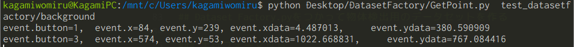

# Dataset Factory

背景画像と前景画像を任意のオプションで合成し、データセットを作成するツールです。
物体検出用のデータセットを作成しますが、単なるクラス分類にも使用できます。

**Tensorflow object detection API**で使用できることを確認しました。

# TODO

- GetPoint.pyを"クリックするだけでcsvファイルに入力するように変更"
- 画像処理を加えてから合成する際の精度について比較
- 処理速度の向上
    - tmpディレクトリに一時ファイルを上書きしすぎる問題を解決
- 背景、前景画像ともにjpgしか受け付けない問題
    - pngに対応させたい
- DatasetFactory.pyのoutput_dirオプションを省略したときに生成されるアノテーションファイルの中身の"ファイルパス"が相対パスになっている問題
- KizunaAIでテストすると中身がすっかすかでした。

# 機能

## Union.py

画像生成

- 特定の色を切り抜き、前景画像と背景画像の合成(クロマキー合成)
- アノテーションデータのダンプ
- 任意の位置に前景画像を設置
  
画像処理

- 前景画像の拡大縮小
- 前景画像のアフィン回転
- 前景画像の射影変換
- 簡易擬似遮蔽物生成
- 前景画像の明度の調整
- 背景画像の鮮鋭化
- 画像全体のセピア変換
- その他の補助処理
    - クロージング
    - 前景画像サイズ自動調整


## DatasetFactory.py

- 前景画像の位置をランダムにする
- アノテーションファイルの書き出し
- 合成画像の書き出し

### 使用用途

学習用画像データを用意するのを少ない労力で行えるようにしたものです。**Tensorflow object detection API**で使用することを想定しているが、他の用途にも使うことができます。


# 必要なモジュール/ソフトウェア

ここで示すモジュールのバージョンは、テストした段階でのバージョンです。

|モジュール/ソフトウェア|バージョン|備考|
|-|-|-|
|Python|2.7|Tensorflow object detection APIがpython2.7対応だったので。|
|OpenCV|3.4.3|-|
|Pillow|5.3.0|-|
|numpy|1.15.2|-|
|matplotlib|2.2.3|-|
|Tensorflow|1.10.0|CPU/GPU版は問いません。|
|python-tk|2.7.15|aptでインストール。*GetPoint.pyで使用*|

# 使用方法

## GetPoint.pyで前景画像の設置可能領域を指定


```shell

$ python GetPoint.py 画像があるディレクトリ

```

画像が表示されたら、左クリック:event.button1,右クリック:event.button3を使って、画像の座標情報をターミナルに表示させます。

ウインドウの"X"をクリックすると次の画像に遷移します。すべての画像の設定が終わるとプログラムが終了します。




**xdata**と**ydata**が座標です。この値をGetPoint.csvに入力します。

GetPoint.csvの入力フォーマットは

|画像名（パスではない）|xmin|ymin|xmax|ymax|

です。データは２行目以降に入力してください。１行目は読みやすいように列名を入力しています。

**画像名については、ファイルパスを書く必要はありません。**


## Dataset Factory.pyをつかって物体検出用のデータセットを作る

### 実行フォーマット

```shell

$ python DatasetFactory --Background_dir "背景画像が入ったディレクトリ" \
                        --Output_dir "出力ディレクトリ" \
                        --Target_dir "前景画像が入ったディレクトリ" \
                        --annotation_file "アノテーションファイル" \
                        --init "実行時にアノテーションファイルを初期化するか?" \
                        --label "ラベルid" \
                        --name "クラス名(cat,dog,など)" \
                        --recipe_file "GetPoint.pyで作成した、ターゲットの配置場所がかかれているCSVファイル"

#オプションを確認する場合は以下のオプションを付けます。
$ python DatasetFactory -h

```

### 実行例

```shell
# ラベルID:1,クラス名KizunaAIのデータセットを作る場合

$ python DatasetFactory.py --recipe_file ./getpoint.csv \
                           --annotation_file ./annotation.csv \
                           --init true \
                           --label 1 \
                           --Background_dir ./Background/ \
                           --Target_dir ./Target/ \
                           --Output_dir ./Output/ \
                           --name KizunaAi

```

作りたいデータセットが2個以上ラベルIDが必要な場合は以下のようなシェルスクリプトを作成すれば対応できます。

```shell

#!/bin/bash
#VTuber３人を識別するためのデータセットを作りたいとき

Vtubers=(KizunaAI MiraiAkari Siro)

i=1
mkdir ~/datasets/Vtuber/

for Vtuber in "${Vtubers[@]}"
do
    python DatasetFactory.py 
            --recipe_file ~/datasets/Vtuber/getpoint.csv \
            --annotation_file ~/datasets/Vtuber/annotation.csv \
            --init false \
            --label $i \
            --Background_dir ~/datasets/Background/ \
            --Target_dir ~/datasets/$Vtuber/ \
            --Output_dir ~/datasets/Vtuber \
            --name $Vtuber
    i=`expr $i + 1`
done

```

## Union.pyをインポートして、各々の用途で使用する場合

### Union関数

Union関数は、画像１枚を与えられたオプションに従って合成します。戻り値は合成後の画像と画像の縦と横のサイズです。
画像を出力する場合、Pillowモジュールの`plt.imshow()`や`save`関数を使います。OpenCVで書き出す場合は変換する必要があります。

この関数でできることはUnion_Tuning.ipynbで視覚的に体験できます。

### 指定可能な引数

任意の引数を省略した場合、デフォルトが使用されます。

|引数|説明|デフォルト|必須/任意|
|-|-|-|-|
|label_name|ラベルIDを指定|"?"|任意|
|bak|背景画像のパスを指定|None|**必須**|
|tar|前景画像のパスを指定|None|**必須**|
|SharpBackground|背景画像を鮮鋭化するか？|False|任意|
|Brightness_mode|明るさを変更する方法を選択(No,PIL,OpenCV)|No|任意|
|dilate|クロージング処理時の拡大率|0|任意|
|erode|クロージング処理時の縮小率|0|任意|
|X,Y|前景画像の設置座標|X=0,Y=0|任意|
|angle|アフィン回転角度|0|任意|
|resize|前景画像の拡大率(0.9以下は縮小します)|1|任意|
|R,G,B|切り抜く色|R=248,G=248,B=248(白色)|任意|
|Threshould|２値化した時の閾値（処理の中で輪郭抽出を行う際に使用します。)|248|任意|
|brightness|明度(0.9以下は暗くなります。Brightness_modeの設定がNoの時は反映されません)|1.0|任意|
|BilateralFilter|バイラテラルフィルタで前景画像をぼかします。|1|任意|
|GausianFilter|ガウシアンフィルタで前景画像をぼかします。偶数の値を入れると反映されません。|1|任意|
|HideNum|ランダムに生成する簡易着遮蔽物の数を指定|0|任意|
|x1_Ho,~~,y4_ho|ホモグラフィー変換後の座標を指定します。|それぞれ=0|任意|

### 実装例

```python

# ラベルIDを1,背景画像をbackground.jpgに、前景画像をKizunaAI.jpgに、前景画像を設置する座標を(150,200)に、前景画像サイズを２倍にして合成する。

from Union import *
from PIL import Image

out,tar_h,tar_w=Union(
                label_name=1 ,
                bak="~/dataset/background.jpg",
                tar="~/dataset/KizunaAI.jpg",
                X=150,Y=200,
                resize=2
                )

print "ラベル："+str(label_name)
print "高さ："+str(tar_h)
print "幅："+str(tar_w)

out.save("./output.jpg)

```

# ファイル構成

### DatasetFactory.py

Tensorflow object detectionAPIで物体検出を行う場合、このスクリプトを実行するとすぐにデータが用意できる。Union.pyの使用方法を示したサンプルプログラムであるため、それぞれの用途に適さない場合があります。

### Union.py

他の用途で使う場合、Tensorflow以外で学習を行う場合など、使用想定外で使う場合は、Union.pyのUnionをインポートします。この関数が合成ツールの本体です。

### Union_Tuning.ipynb

ノートブック形式で、簡単な操作で各種画像合成オプションが試せます。どのように画像を合成させるかの調整用として使います。Union.pyのデモとしても使用できます。


### UnionKit.py

画像処理部分と合成部分の関数を実装しています。このプログラムだけでは合成できませんが、画像処理関数を多く定義しているので、データ拡張などの用途に利用できます。

### Augmentation.py

元々はデータ拡張用関数を定義するつもりだったが、未使用です。DarkMode関数は、合成した画像を夜っぽくする機能ですが、あまり夜っぽくなりません。

### GetPoint.py

背景画像に対して、どこに前景画像を配置させるかの領域を指定する際に使用する。ただし、今のところ、クリックした場所の座標が表示されるのみで、座標情報はGetPoint.csvにて手入力する必要があります。

### GetPoint.csv

DatasetFactory.pyで必要です。前景画像の配置可能領域を指定したファイルです。フォーマットは以下の通りです。

```

背景画像名(hoge.jpg),開始位置(minX,minY),終了位置(maxX,maxY)

```

この他のディレクトリ、ファイルについては直接関係があるものではないので説明を省略します。
