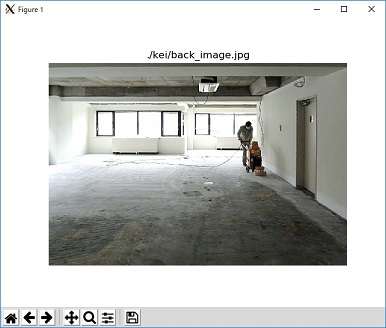
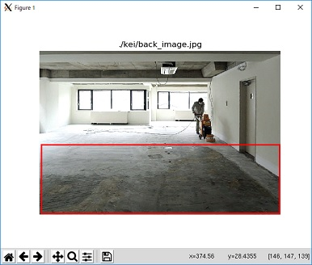

# DatasetFactory
DatasetFactoryは前景画像と背景画像を合成することで画像枚数を増やすためのデータセット作成ツールです。<br>
このツールは **Tensoflow_Object_Detection_API** で使用できることを確認しました。 
<br><br>

# TODO
- 画像処理を加えてから合成する際の精度について比較
- 処理速度の向上
    - tmpディレクトリに一時ファイルを上書きしすぎる問題を解決
- 背景、前景画像ともにjpgしか受け付けない問題
    - pngに対応させたい
- DatasetFactory.pyのoutput_dirオプションを省略したときに生成されるアノテーションファイルの中身の"ファイルパス"が相対パスになっている問題


# ファイル構成
<dl>
    <dt><strong>DatasetFactory.py</strong></dt>
    <dd>Tensorflow object detectionAPIで物体検出を行う場合、このスクリプトを実行すると画像を増やし, 学習に必要なアノテーションデータを作成してくれます。</dd><br>
    <dt><strong>Union.py</strong></dt>
    <dd>他の用途で使う場合、Tensorflow以外で学習を行う場合など、使用想定外で使う場合は、Union.pyのUnionをインポートします。この関数が合成ツールの本体です。</dd><br>
    <dt><strong>Union_Tuning.ipynb</strong></dt>
    <dd>ノートブック形式で、簡単な操作で各種画像合成オプションが試せます。どのように画像を合成させるかの調整用として使います。Union.pyのデモとしても使用できます。</dd><br>
    <dt><strong>UnionKit.py</strong></dt>
    <dd>画像処理部分と合成部分の関数を実装しています。このプログラムだけでは合成できませんが、画像処理関数を多く定義しているので、データ拡張などの用途に利用できます。</dd><br>
    <dt><strong>Augmentation.py</strong></dt>
    <dd>元々はデータ拡張用関数を定義するつもりでしたが、未使用です。DarkMode関数は、合成した画像を夜のようにする機能ですが、効果はあまりないです。</dd><br>
    <dt><strong>GetPoint.py</strong></dt>
    <dd>背景画像に対して、どこに前景画像を配置させるかの領域を指定する際に使用します。</dd><br>
</dl>
この他のディレクトリ、ファイルについては直接関係があるものではないので説明を省略します。
<br><br>

# 必要モジュール

|名称|バージョン|備考|
|:---|:---|:---|
|python|2.7|Tensoflow_Object_Detection_APIがpython2.7のため|
|numpy|1.15.4|-|
|OpenCV|3.4.2|-|
|Pillow|5.3.0|-|
|matplotlib|2.2.3|-|
|Tensorflow|1.11.0|CPU,GPUのどちらでも問題ありません|
<br>

# 機能
## Union.py
画像生成

* 特定の色を切り抜き、前景画像と背景画像の合成(クロマキー合成)
* アノテーションデータのダンプ
* 任意の位置に前景画像を設置

 画像処理

* 前景画像の拡大縮小
* 前景画像のアフィン回転
* 前景画像の射影変換
* 簡易擬似遮蔽物生成
* 前景画像の明度の調整
* 背景画像の鮮鋭化
* 画像全体のセピア変換
* その他の補助処理 
    + クロージング
    + 前景画像サイズ自動調整

## DatasetFactory.py
* 前景画像の位置をランダムにする
* アノテーションファイルの書き出し
* 合成画像の書き出し

<br>

# 使用方法
Tensorflow_Object_Detection_APIの学習に必要なアノテーションデータを作成する流れとしては大まかには以下の通りです。<br>
* GetPoint.py で前景画像の配置する範囲を指定するための背景画像の座標データ作成<br>
* DatasetFactory.py で前景画像と背景画像を実際に合成<br>

## 1. GetPoint.py
### 実行方法
```
python GetPoint.py 背景画像があるディレクトリ
```
実行すると下の画像のように表示されます。<br>


画像内をクリックし, 配置したい範囲までドラッグすることで下の画像のように四角で表示されます。<br>


**Eキー**で指定した範囲の座標, 画像名をデータにいれます。<br>
**Qキー**でデータを以下の形式でGetPoint.csvに保存し, 次の画像を表示します。<br>
```
| filename | xmin | ymin | xmax | ymax | 
```
<br>

## 2. DetasetFactory.py
### 実行形式
```
python DatasetFactory.py --Background_dir="背景画像が入ったディレクトリ"\
                         --Output_dir="出力ディレクトリ" \
                         --Target_dir="前景画像が入ったディレクトリ" \
                         --annotation_file="新規, もしくは追記したいアノテーションファイル" \
                         --init="実行時にアノテーションファイルを初期化するか" \
                         --label="ラベルid" \
                         --name="クラス名(cat, dog, など)" \
                         --recipe_file="GetPoint.pyで作成した, CSVファイル"

```
オプションの確認は以下のように実行します。
```
python DatasetFactory.py -h
```
<br>

### 実行例 
クラス名をCar, ラベルを1, アノテーションファイルをannotation.csvとし, アノテーションファイルを初期化とすると以下のように実行します。
```
python DatasetFactory.py --Background_dir=./Background/ \
                         --Output_dir=./Output/ \
                         --Target_dir=./Target/ \
                         --annotation_file=annotation.csv \
                         --init=true \
                         --label=1 \
                         --name=Car \
                         --recipe_file=GetPoint.csv
```
実行すると以下の形式でcsvに保存されます。<br>
```
| id | xmin | ymin | xmax | ymax |file_path | filename | class |
```
<br>

# Union.pyを単体で使用する場合
## Union関数
画像１枚を与えられたオプションに従って合成します。戻り値は合成後の画像と画像の縦と横のサイズです。画像を出力する場合、Pillowモジュールのplt.imshow()やsave関数を使います。<br>
この関数でできることはUnion_Tuning.ipynbで視覚的に体験できます。

### 指定可能な引数
|引数|説明|デフォルト|指定|
|:--|:--|:--|:--|
|label_name|ラベルIDを指定|"?"|任意|
|bak|背景画像のパスを指定|None|**必須**|
|tar|前景画像のパスを指定|None|**必須**|
|SharpBackground|背景画像を鮮鋭化するか？|False|任意|
|Brightness_mode|明るさを変更する方法を選択(No,PIL,OpenCV)|No|任意
|dilate|クロージング処理時の拡大率|0|任意|
|erode|クロージング処理時の縮小率|0|任意|
|X,Y|前景画像の設置座標|X=0,Y=0|任意|
|angle|アフィン回転角度|0|任意|
|resize|前景画像の拡大率(0.9以下は縮小します)|1|任意|
|R,G,B|切り抜く色|R=248,G=248,B=248(白色)|任意|
|Threshould|２値化した時の閾値（処理の中で輪郭抽出を行う際に使用します。)|248|任意|
|brightness|明度(0.9以下は暗くなります。Brightness_modeの設定がNoの時は反映されません)|1.0|任意 |
|BilateralFilter|バイラテラルフィルタで前景画像をぼかします。|1|任意|
|GausianFilter|ガウシアンフィルタで前景画像をぼかします。偶数の値を入れると反映されません。|1|任意|
|HideNum|ランダムに生成する簡易着遮蔽物の数を指定|0|任意|
|x1_Ho,~,y4_ho|ホモグラフィー変換後の座標を指定します。|それぞれ=0|任意|

### 実装例
```python
# ラベルIDを1,背景画像をbackground.jpgに、前景画像をCar.jpgに、前景画像を設置する座標を(150,200)に、前景画像サイズを２倍にして合成する。

from Union import *
from PIL import Image

out,tar_h,tar_w=Union(
                label_name=1 ,
                bak="~/dataset/background.jpg",
                tar="~/dataset/Car.jpg",
                X=150,Y=200,
                resize=2
                )

print "ラベル："+str(label_name)
print "高さ："+str(tar_h)
print "幅："+str(tar_w)

out.save("./output.jpg)
```


